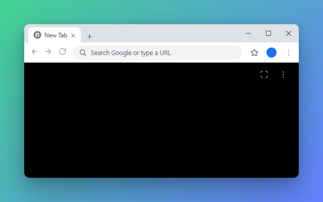
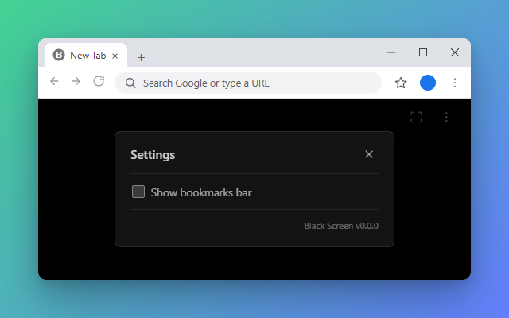
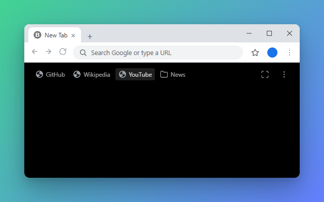

# Black Screen

  

  
  
  

  A minimal Chrome extension that replaces your new tab page with a pure black screen.

---

## Screenshots

<table>
  <tr>
    <td align="center">
       
      Pure black, until you move the mouse
    </td>
    <td align="center">
       
      Fullscreen — no browser chrome at all
    </td>
  </tr>
  <tr>
    <td align="center">
       
      Settings — the only menu there is
    </td>
    <td align="center">
       
      On-screen bookmarks bar, turned on from Settings
    </td>
  </tr>
</table>

## Features

- **Pure Black**: Opens an instant, distraction-free pure black screen in a new tab.
- **Auto-hiding Cursor & Toolbar**: The cursor and on-screen toolbar (fullscreen, bookmarks bar, settings) appear on interaction and automatically fade away after 1 second of inactivity.
- **Fullscreen Toggle**: Use the on-screen button to enter or exit browser fullscreen mode. Press `Esc` to exit fullscreen.
- **Bookmarks Bar**: An on-screen bookmarks bar that mirrors your browser's actual bookmarks bar, since replacing the new tab page hides Chrome's own one. Turn it on from Settings (⋮ menu, top right).
- **Settings**: A single ⋮ menu in the top right — toggle the bookmarks bar and see the installed version. Nothing else to configure.
- **Touch Support**: Touch start and movement reveal the cursor and toolbar on touch-enabled devices.
- **Minimal Permissions**: Only reads your bookmarks and favicons to render the on-screen bookmarks bar — nothing is tracked, sent anywhere, or stored outside your browser.
- **No Clutter**: No tracking, no ads, no unnecessary UI — just black, with a couple of opt-in extras.

## Installation

### From Chrome Web Store
Install directly from the [Chrome Web Store](https://chromewebstore.google.com/detail/black-screen/bdcmhoaiaafaadfkfjcpchckgcdpagkj).

### Manual Installation (For Developers)
1. Clone or download this repository.
2. Open `chrome://extensions/` in Chrome and enable **Developer mode** (top right).
3. Click **Load unpacked** and select the `black-screen` root directory.

## License

This project is licensed under the [Apache License 2.0](LICENSE).
