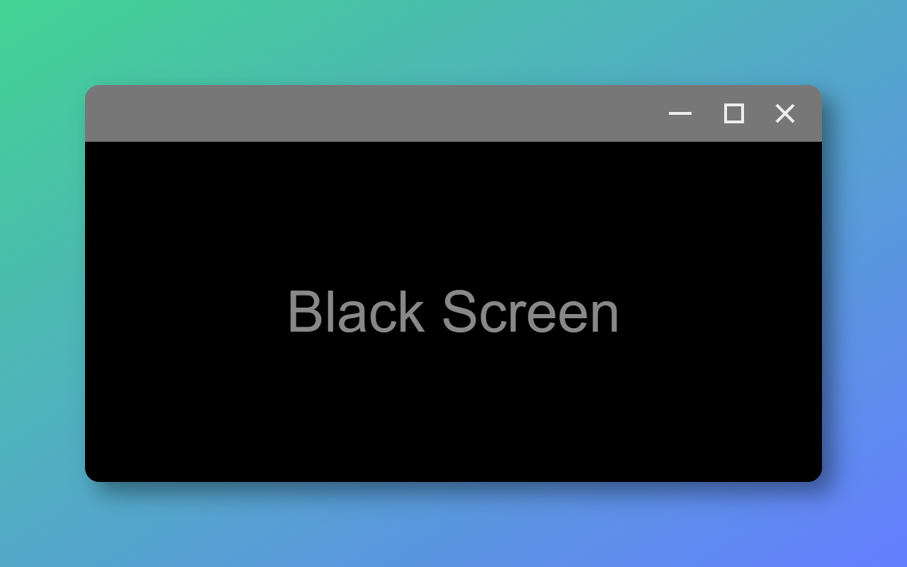
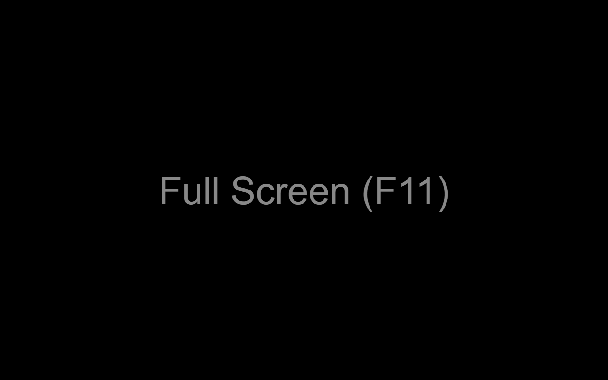

# Black Screen

  

  
  
  

  A minimal Chrome extension that replaces your new tab page with a pure black screen.

---

## Preview

  
  

## Features

- **Pure Black**: Opens an instant, distraction-free pure black screen in a new tab.
- **Auto-hiding Cursor & Fullscreen Button**: The cursor and fullscreen button appear on interaction and automatically fade away after 1 second of inactivity.
- **Fullscreen Toggle**: Use the on-screen button to enter or exit browser fullscreen mode. Press `Esc` to exit fullscreen.
- **Touch Support**: Touch start and movement reveal the cursor and fullscreen button on touch-enabled devices.
- **Zero Permissions**: Completely lightweight, private, and offline-ready without requesting any browser permissions.
- **No Clutter**: No settings, no tracking, no ads — just black.

## Installation

### From Chrome Web Store
Install directly from the [Chrome Web Store](https://chromewebstore.google.com/detail/black-screen/bdcmhoaiaafaadfkfjcpchckgcdpagkj).

### Manual Installation (For Developers)
1. Clone or download this repository.
2. Open `chrome://extensions/` in Chrome and enable **Developer mode** (top right).
3. Click **Load unpacked** and select the `black-screen` root directory.

## License

This project is licensed under the [Apache License 2.0](LICENSE).
