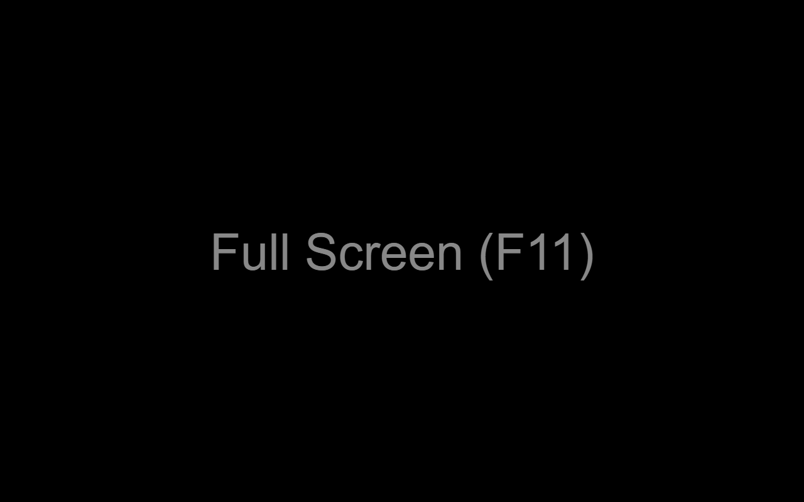

# Black Screen

**Black Screen** is a minimal Chrome extension that replaces your new tab page with a pure black screen.

## Preview (conceptual)

## Features

- Opens a pure black screen in a new tab
- No settings, no clutter — just black
- Lightweight and private (no permissions required)
- Fully open source at: https://github.com/jmnote/black-screen

## Installation

You can install it from the [Chrome Web Store](https://chromewebstore.google.com/detail/black-screen/bdcmhoaiaafaadfkfjcpchckgcdpagkj).

## License

This project is licensed under the [Apache License 2.0](LICENSE).
