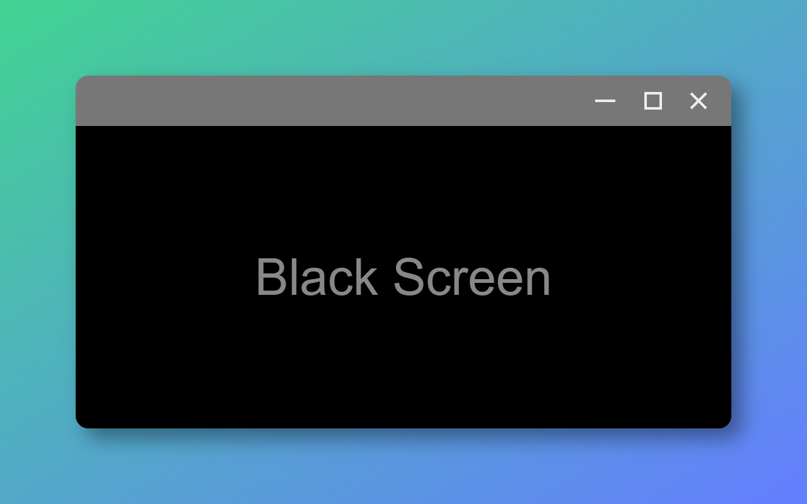
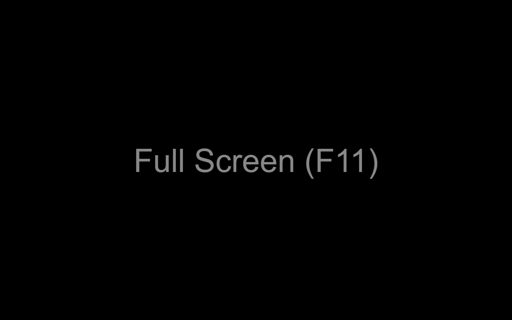
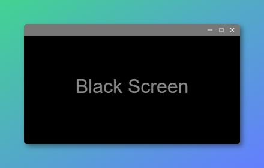
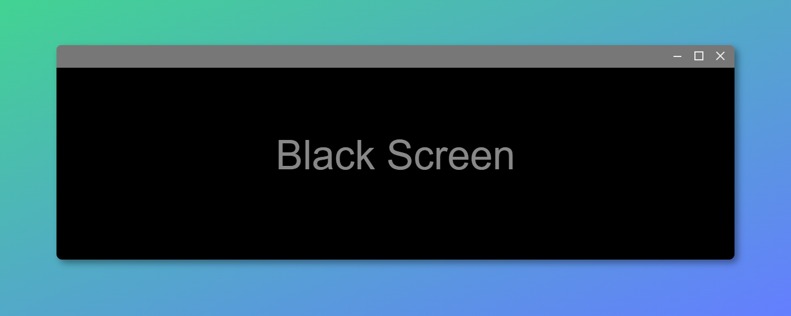

# Chrome Web Store Metadata

## Store listing

### Product details

**Title from package**: Black Screen

**Summary from package**: A pure black screen in a new tab

**Description**:
```
Black Screen is a minimal Chrome extension that opens a pure black screen in a new tab.

FEATURES:
- Opens a pure black screen in a new tab  
- No settings, no clutter — just black  
- Lightweight and private (no permissions required)  
- Fully open source at: https://github.com/jmnote/black-screen
```

**Category**: Tools

**Language**: English (United States)

### Graphic Assets

**Store Icon**:  
<a href="https://github.com/jmnote/black-screen/blob/main/images/icon-128.png">
  
</a>

**Screenshots**:  
<a href="https://github.com/jmnote/black-screen/blob/main/store/assets/screen-window.png">
  
</a>  
<a href="https://github.com/jmnote/black-screen/blob/main/store/assets/screen-full.png">
  
</a>

**Small promo tile**:  
<a href="https://github.com/jmnote/black-screen/blob/main/store/assets/promo-small.png">
  
</a>

**Marquee promo tile**:  
<a href="https://github.com/jmnote/black-screen/blob/main/store/assets/promo-marquee.png">
  
</a>

### Additional Fields

**Official URL**: None

**Homepage URL**: https://github.com/jmnote/black-screen

**Support URL**: https://github.com/jmnote/black-screen/issues

**Mature Content**: No

### Additional metrics

**Google Analytics 4 (GA4)**: Enabled (opted in)

## Privacy

**Single Purpose**: This extension replaces the new tab with a pure black screen.

### Permission Justification

**Are you using remote code?** 🔘 No, I am not using remote code.

### Data Usage

**What user data do you plan to collect from users now or in the future?**  
(All options are unchecked — this extension does not collect any user data.)

☐ Personally identifiable information  
☐ Health information  
☐ Financial and payment information  
☐ Authentication information  
☐ Personal communications  
☐ Location  
☐ Web history  
☐ User activity  
☐ Website content

**I certify that the following disclosures are true**:  
✅ I do not sell or transfer user data to third parties, outside of the approved use cases  
✅ I do not use or transfer user data for purposes that are unrelated to my item's single purpose  
✅ I do not use or transfer user data to determine creditworthiness or for lending purposes

**Privacy Policy URL**: None

## Distribution

**Payments**: 🔘 Free of charge

**Visibility**: 🔘 Public

**Distribution**: ✅ All regions
