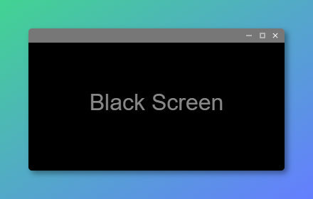
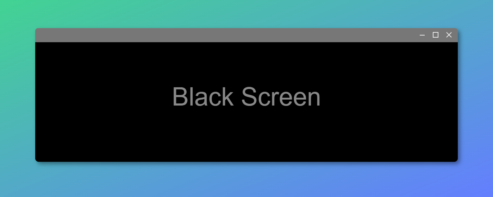

# Chrome Web Store Metadata

## Store listing

### Product details

**Title from package**: Black Screen

**Summary from package**: A pure black screen in a new tab

**Description**:
```
Black Screen is a minimal Chrome extension that opens a pure black screen in a new tab.

FEATURES:
- Opens a pure black screen in a new tab  
- Fullscreen toggle, with an auto-hiding cursor and toolbar  
- Optional on-screen bookmarks bar, since the real one is hidden behind the replaced new tab page  
- Lightweight and private — nothing is tracked, collected, or sent anywhere  
- Fully open source at: https://github.com/jmnote/black-screen
```

**Category**: Tools

**Language**: English (United States)

### Graphic Assets

**Store Icon**:  
<a href="https://github.com/jmnote/black-screen/blob/main/images/icon-128.png">
  
</a>

**Screenshots**:  
<a href="https://github.com/jmnote/black-screen/blob/main/store/screenshot/screenshot1-default.png">
  
</a>  
<a href="https://github.com/jmnote/black-screen/blob/main/store/screenshot/screenshot2-fullscreen.png">
  
</a>  
<a href="https://github.com/jmnote/black-screen/blob/main/store/screenshot/screenshot3-settings.png">
  
</a>  
<a href="https://github.com/jmnote/black-screen/blob/main/store/screenshot/screenshot4-bookmarks.png">
  
</a>

**Small promo tile**:  
<a href="https://github.com/jmnote/black-screen/blob/main/store/assets/promo-small.png">
  
</a>

**Marquee promo tile**:  
<a href="https://github.com/jmnote/black-screen/blob/main/store/assets/promo-marquee.png">
  
</a>

### Additional Fields

**Official URL**: jmnote.com

**Homepage URL**: https://github.com/jmnote/black-screen

**Support URL**: https://github.com/jmnote/black-screen/issues

**Mature Content**: No

### Additional metrics

**Google Analytics 4 (GA4)**: Disabled

## Privacy

**Single Purpose**: This extension replaces the new tab with a pure black screen, with an optional on-screen bookmarks bar.

### Permission Justification

**bookmarks**: Chrome's native bookmarks bar is tied to its own New Tab Page — once an extension overrides the new tab, as this one does, that bookmarks bar no longer shows there, even with "Always show bookmarks bar" turned on, and there's no way to bring it back on this page. This permission lets the extension read the Bookmarks Bar folder and offer an on-screen bookmarks bar of its own as an in-page option, off by default — you turn it on from the Settings menu only if and when you want it. Read locally to render the UI only — never transmitted anywhere.

**favicon**: Used with Chrome's built-in favicon API to show each bookmark's site icon next to its name in the on-screen bookmarks bar. Makes no network requests of its own.

**Are you using remote code?** 🔘 No, I am not using remote code.

### Data Usage

**What user data do you plan to collect from users now or in the future?**  
(All options are unchecked — this extension does not collect any user data.)

☐ Personally identifiable information  
☐ Health information  
☐ Financial and payment information  
☐ Authentication information  
☐ Personal communications  
☐ Location  
☐ Web history  
☐ User activity  
☐ Website content

**I certify that the following disclosures are true**:  
✅ I do not sell or transfer user data to third parties, outside of the approved use cases  
✅ I do not use or transfer user data for purposes that are unrelated to my item's single purpose  
✅ I do not use or transfer user data to determine creditworthiness or for lending purposes

**Privacy Policy URL**: None

## Distribution

**Payments**: 🔘 Free of charge

**Visibility**: 🔘 Public

**Distribution**: ✅ All regions
